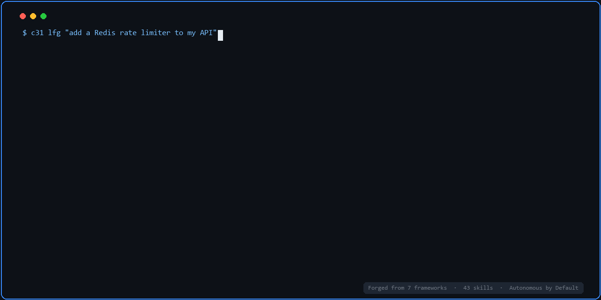

# C31 — Loop-Ready Agent Harness



> You wrote 1,000 prompts for your AI. Then the conversation reset. It forgot everything.
> This is why you need an agent harness — not better prompts, but a persistent operating layer
> that runs autonomously, learns from every session, and connects to Loop Engineering when you're ready.

**C31** is the agent harness forged from 7 open-source frameworks and 5 months of daily production use.  
Memory that persists. Instincts that evolve. Context that stays healthy. Loop-ready when you need it.

[](LICENSE)
[](skills/)
[](#compatibility)
[](#languages)
[](https://github.com/ChianW/C31-papers/blob/master/part11_loop_engineering.md)

> 🇨🇳 [中文版](README.zh.md) · 🇯🇵 [日本語版](README.ja.md) · 🔄 [Loop Engineering Integration](https://github.com/ChianW/C31-papers/blob/master/part11_loop_engineering.md)

---

## Built With C31

| Project | Description |
|---------|-------------|
| **[chian.io](https://chian.io)** | *"Being Human is a Luxury."* — A knowledge platform and personal OS exploring taste, judgment, and the irreducible human edge. Products include Investment OS, The Silicon Boardroom (podcast), Project Q, and System Reboot. |
| **[chian.io/investment-os](https://chian.io/investment-os)** | *Master Clone System* — Buffett's 70 years of shareholder letters (1956–2025) + Howard Marks' 160+ memos (1990–2026), decoded into fully cross-linked knowledge graphs queryable by humans and AI agents. |
| **[chian.io/kyoto](https://chian.io/kyoto)** | *A philosopher's map of Kyoto.* — 61 temples, shrines, and sacred paths, each one connected to an essay on time, impermanence, and the examined life. Travel as philosophy. |
| **[agi-cd.com](https://agi-cd.com)** | *AGI Countdown — Calibrating the Only Question That Matters.* — A daily signal feed counting down to AGI Zero Day (2029-03-07). Cross-disciplinary insights from philosophy, history, economics, geopolitics, and investing to align your thinking with the post-AGI world. |

*Built something with C31? Open a PR to add it here.*

---

## What is C31?

In seven years running a think tank and investment firm, AI arrived and changed everything. I gradually realized that the only question worth thinking about was: *what will society look like after AGI?* In 2025, I made a decisive move — I let my investment firm become a company of just me and Agents.

Within the first week of building, I discovered the core problem: **the AI was brilliant at generating code and completely incapable of remembering anything.**

I needed a system — not better prompts. So I audited 7 open-source agent frameworks in 48 hours and forged their best ideas into a unified harness. That system is C31.

Most prompt collections give you one-shot instructions. C31 gives you a **persistent operating system for your AI**:

| Layer | What It Does |
|-------|-------------|
| **Skills** (43) | Structured workflows: brainstorm → plan → work → **simplify** → review → compound |
| **Memory System** | `session_state.json` + diary + instincts — state persists across sessions |
| **Instinct Evolution** | AI learns from every interaction; patterns graduate from `candidate → verifying → instinct` |
| **Context Health** | 🟢🟡🟠🔴 four-state monitoring prevents context rot in long sessions |
| **Psych-Framing** | Step-by-step reasoning enforcement + confidence-check output validation |
| **Critic Gate** | Auto quality gate: outputs >300 words with inferred conclusions trigger self-audit |

**→ [Quick Install](#quick-install)** · **[43 Skills](skills/)** · **[12 Papers](https://github.com/ChianW/C31-papers)** · **[Philosophy](PHILOSOPHY.md)**

---

## The 2026 Consensus

In 2025–2026, seven independent open-source projects attacked the same problems from different angles. They had different authors, different philosophies, different star counts. But they converged on five conclusions:

**1. Architecture beats prompts.**
Reliability doesn't come from better wording. It comes from structure — explicit control flow, quality gates, state management. You don't prompt your way to production-grade agents. You engineer them.

**2. Agents need persistent state.**
Session-scoped memory is not enough. Instincts, learnings, and decisions must survive across conversations. The agent should get smarter over time, not reset to baseline every session.

**3. Multi-agent orchestration beats monolithic agents.**
A specialized small agent that does one thing well outperforms a single agent trying to brainstorm, code, test, review, and document all in one context window. Delegation is not a feature — it's an architectural requirement.

**4. Human-in-the-loop is a first-class operation.**
Irreversible actions need approval gates. The best systems make the boundary between "AI decides autonomously" and "AI pauses for human input" explicit and configurable.

**5. Knowledge compounds — if you capture it.**
The final step of every workflow should leave the system better than it found it. Document the solution. Index it. Make it searchable. The next time the same class of problem appears, it should take minutes, not hours.

---

## The 5-Layer Architecture

```
┌─────────────────────────────────────────────────────────────┐
│  AGENTS.template.md  (GEMINI.md / CLAUDE.md / AGENTS.md)   │
│  ─ Engineering principles  ─ Decision boundaries            │
│  ─ Ambient weighting       ─ Critic Gate                    │
│  ─ Psych-framing layer     ─ Fix-it Cascade                 │
├─────────────────────────────────────────────────────────────┤
│  SKILLS (43)                                                │
│  core/ · review/ · product/ · utils/ · personal/           │
├─────────────────────────────────────────────────────────────┤
│  MEMORY SYSTEM                                              │
│  session_state.json  ←→  diary/  ←→  instincts/            │
├─────────────────────────────────────────────────────────────┤
│  INSTINCT EVOLUTION                                         │
│  candidate (1/3) → verifying (2/3) → instinct (3/3)        │
│  confidence: 0.3–0.9 · deprecated if <0.3                  │
├─────────────────────────────────────────────────────────────┤
│  CONTEXT HEALTH                                             │
│  🟢 <50%  🟡 50-70%  🟠 70-85%  🔴 >85% → force checkpoint │
└─────────────────────────────────────────────────────────────┘
```

---

## What Makes C31 Different

### 1. A Workflow with Hard Gates — Not a Checklist

> *Forged from: Compound Engineering Plugin (lifecycle) + 12-Factor Agents (F12: Stateless Reducer) + Archon (deterministic pipelines)*

Most AI workflows are checklists. C31's lifecycle is a **pipeline** — each step takes structured output from the previous step as its only input, and produces structured output for the next. Context is passed as files, not conversation.

```
Brainstorm → Plan → Work → Simplify → Review → Compound
   ↓             ↓        ↓          ↓         ↓          ↓
Decision doc  Plan+    Tests     No regressions  APPROVED  docs/solutions/
(numbered)    threat    green      verified               + INDEX entry
              model
```

Every step has a **verification gate** — a binary condition that must be true before the next step begins. Plans require human approval. Tests must be green before review. Solutions require an INDEX entry before being declared done.

> **Why it matters:** An INDEX entry without the document is invisible. A document without an INDEX entry is also invisible. C31 enforces both. → [Full Workflow Architecture](WORKFLOW.md)

---

### 2. Multi-Agent Orchestration — 4 Patterns

> *Forged from: Compound Engineering (compound subagents) + Archon (subagent governance) + Superpowers (Do Not Trust the Report)*

C31 uses four distinct subagent orchestration patterns. The core architectural principle across all four: **specialized agents working in parallel outperform a single agent trying to do everything.**

#### Pattern A — Parallel Adversarial Review

4 isolated agents review the same code simultaneously. A 5th agent detects contradictions between them.

```
            Code / Diff
               │ (broadcast)
  ┌────────────┼────────────┐────────────┐
  ▼            ▼            ▼            ▼
CORRECTNESS  SECURITY  MAINTAINABILITY SIMPLICITY
  (isolated)  (isolated)   (isolated)   (isolated)
  │            │            │            │
  └────────────┼────────────┘────────────┘
               ▼
        CONFLICT AGENT (5th)
        Detect contradictions · Severity gaps · Human flags
               ▼
        SYNTHESIS: APPROVED / WARNED / BLOCKED
```

**Why isolated agents?** Isolation prevents groupthink. A reviewer hunting for security vulnerabilities won't also notice over-engineering — unless that's all they're looking for. Each of the 4 agents operates in read-only mode with zero knowledge of the other agents' findings, so their disagreements become signal, not noise.

#### Pattern B — Parallel Knowledge Extraction

When a problem is solved, 3 agents run simultaneously to extract different dimensions of the solution:

| Agent | Extracts |
|-------|---------|
| **Context Analyzer** | What was the situation? What was tried? What constraints existed? |
| **Solution Extractor** | What was the exact fix? Root cause? Why does it work? Verbatim commands. |
| **Related Docs Finder** | What prior solutions relate? Index gaps? Where does this belong? |

Output is assembled into a single solution document + mandatory INDEX entry.

#### Pattern C — Fix-it Cascade

```
"fix it" → C31-debug → Fix (surgical) → Verify → C31-compound
                                ↑___FAIL___|
```

Triggered automatically on any debug request. Self-closing loop. The 3-consecutive-failure rule: if the same class of fix fails 3 times in a row, the cascade halts and escalates — no blind retries.

#### Pattern D — 12-Gate Full Automation (C31-lfg)

For approved plans, `lfg` runs a deterministic 12-gate pipeline to completion without interruption:

`Plan validation → Dependency check → Test baseline → Implement → Multi-review → Unit tests → Integration tests → Nyquist coverage → Simplify → Security scan → Build verify → Compound`

Stop conditions are explicit. Everything else runs unattended.

---

### 3. Autonomous by Default

> *Forged from: 12-Factor Agents (F12) + ECC (confidence scoring)*

**The default state is full autonomy.** The AI executes, iterates, self-corrects, and compounds knowledge without interruption. Human intervention is reserved for exactly two conditions:

- **Irreversible scope** — file overwrites, deletion, external publishing
- **Low intent confidence** — below 0.55, one clarifying question. Then execute.

Everything else — including the 12-gate pipeline, Fix-it Cascade, parallel review, and knowledge extraction — runs in a closed autonomous loop.

**Confidence Routing** governs when the AI speaks before acting:

| Confidence | Behavior |
|------------|----------|
| ≥0.75 | Execute directly. No check-in. |
| 0.55–0.74 | One-sentence confirmation: "You mean X, right?" |
| <0.55 | One clarifying question. Then execute. |

---

### 4. The Self-Improving Loop

> *Forged from: ECC (continuous learning + confidence scoring) + agent-skills (anti-sycophancy)*

C31's instinct system evolves entirely autonomously. No configuration files. No human teaching required.

```
Pattern observed → candidate instinct (confidence: 0.5)
Pattern repeats  → verifying instinct (confidence: 0.7)
Pattern verified → instinct (confidence: 0.9) — auto-applied, no confirmation

User says "that's wrong" → confidence drops to 0.1 → deprecated → never suggested again
```

Pre-loaded seed instincts:
```
instinct-001-no-overwrite.md     confidence: 0.95  ← never overwrite existing files
instinct-002-research-first.md   confidence: 0.90  ← always research before acting
instinct-003-surgical-changes.md confidence: 0.90  ← modify only what's necessary
instinct-004-compound-trigger.md confidence: 0.85  ← auto-run compound after ≥2 file changes
```

Session state persists across conversations: `session_state.json` + daily diary + instinct index. Each session starts where the last one ended.

```
~/.cystem31/
├── memory/
│   ├── session_state.json   ← active projects, open todos, pending decisions
│   ├── diary/YYYY-MM-DD.md  ← daily session logs
│   └── instincts/           ← evolved behavioral patterns with confidence scores
└── solutions-registry.md    ← cross-project solution index
```

---

### 5. Knowledge Flywheel

> *Forged from: Compound Engineering Plugin (compound step) + GSD Core (artifacts over memory)*

Every solved problem becomes searchable institutional memory. The flywheel:

```
Solve → C31-compound → docs/solutions/[category]/YYYY-MM-DD.md
                              ↓
                        Update INDEX.md  ← MANDATORY
                              ↓
                 solutions-registry.md (cross-project)
                              ↓
              Next session: Pre-Search silently checks registry
                              ↓
              Hit → "📋 Found prior art" → inject into context
              Miss → continue silently
                              ↓
          Next occurrence of same problem: minutes, not hours
```

Any new project bootstrapped with C31 instantly inherits all prior solutions.

---

### 6. Context Health Monitoring

> *Forged from: 12-Factor Agents (F3: Own Your Context Window) + GSD Core (Context Rot)*

Long sessions degrade AI quality silently. C31 monitors and acts:

| State | Usage | Action |
|-------|-------|--------|
| 🟢 Green | <50% | Normal operation |
| 🟡 Yellow | 50–70% | Begin compressing completed work |
| 🟠 Orange | 70–85% | Move decisions to files, archive assumptions |
| 🔴 Red | >85% | Force checkpoint: write state, then continue |

---

### 7. Psychological Framing Layer

> *Forged from: Superpowers (Cialdini compliance) + agent-skills (Doubt Gate, anti-sycophancy)*

- **Step-by-step reasoning**: Internal chain-of-thought before output reduces errors ~34%
- **Critic Gate**: Auto-triggered self-audit on inferred conclusions >300 words
- **Anti-sycophancy**: Technical rigor over social comfort — disagreement triggers independent evaluation, not capitulation
- **Doubt Gate**: For irreversible operations, write the claim → isolate the minimal auditable unit → generate a fresh-context adversarial reviewer

---


## Quick Install

```bash
git clone https://github.com/ChianW/C31.git
cd C31
./install.sh          # macOS / Linux — installs core skills
.\install.ps1         # Windows PowerShell

./install.sh all      # everything (43 skills)
./install.sh product  # product/business skills only
```

**Then copy `AGENTS.template.md` to your project root:**

| Your Tool | Filename | Language |
|-----------|----------|----------|
| Gemini CLI / Antigravity | `GEMINI.md` | [EN](AGENTS.template.md) · [中文](AGENTS.template.zh.md) · [日本語](AGENTS.template.ja.md) |
| Claude Code / Codex | `CLAUDE.md` | [EN](AGENTS.template.md) · [中文](AGENTS.template.zh.md) · [日本語](AGENTS.template.ja.md) |
| OpenClaw / Hermes / Kimi CLI | `AGENTS.md` | [EN](AGENTS.template.md) · [中文](AGENTS.template.zh.md) · [日本語](AGENTS.template.ja.md) |

Replace `{YOUR_HOME}`, `{YOUR_PROJECT}`, `{MEMORY_DIR}` with your actual paths.

---

## The Guides

> Full documentation is in [PHILOSOPHY.md](PHILOSOPHY.md) · [中文](PHILOSOPHY.zh.md) · [日本語](PHILOSOPHY.ja.md)

| Guide | What You'll Learn |
|-------|------------------|
| **[Quick Start](AGENTS.template.md)** | Install, configure, and run your first C31 session |
| **[Engineering Philosophy](PHILOSOPHY.md)** | The 5 Karpathy principles + Doubt-Driven Development + Chesterton's Fence + Confidence Routing |
| **[Workflow Architecture](WORKFLOW.md)** | The 6-step lifecycle + 4 multi-agent orchestration patterns (with Mermaid diagrams) |
| **[C31 vs Individual Frameworks](ADVANTAGES.md)** | Why each of the 7 frameworks falls short alone — and what C31 adds |
| **[Error Governance](ERROR-GOVERNANCE.md)** | 3-tier error classification · Fix-it Cascade · No Autonomous Lifecycle Mutation |
| **[Memory System](AGENTS.template.md#session-startup-protocol)** | How session state, diary, and instincts work together |
| **[Instinct Evolution](AGENTS.template.md#instinct-system)** | How patterns graduate from candidate to auto-applied instinct |
| **[Context Health](AGENTS.template.md#own-your-context-window)** | Managing the 4-state context system for long sessions |
| **[Skill Index](skills/)** | All 43 skills with triggers in EN · ZH · JA |
| **[Subagent Templates](agents/)** | Ready-to-use reviewer, compound, and debug subagent prompts |

---

## Skill Index

> Each skill is a standalone instruction file (`SKILL.md`) that activates on trigger words.
---

### 🔧 [core/](skills/core/) — Engineering Workflow (19 skills)

| Skill | Trigger | What it does |
|-------|---------|-------------|
| [C31-1st](skills/core/C31-1st/SKILL.md) | `first principles` / `第一性原理` | Deconstructs any problem to axiomatic facts. Use before planning complex architecture or when you suspect the current approach is wrong. |
| [C31-brainstorm](skills/core/C31-brainstorm/SKILL.md) | `brainstorm` / `头脑风暴` | Turns vague requirements into a numbered decision document. Collaborative dialogue phase — defines **WHAT** before planning **HOW**. |
| [C31-plan](skills/core/C31-plan/SKILL.md) | `plan` / `制定计划` | Converts requirements into a gated execution plan with wave analysis, Nyquist coverage gates, and threat modeling. Output requires human approval. |
| [C31-spec](skills/core/C31-spec/SKILL.md) | `spec` / `写需求` | Writes a structured PRD (Product Requirements Doc) as a contract between intent and implementation. Use before any non-trivial feature. |
| [C31-work](skills/core/C31-work/SKILL.md) | `work` / `实现` | Executes a single implementation unit from an approved plan. Surgical — no scope creep, no unrequested abstractions. |
| [C31-research](skills/core/C31-research/SKILL.md) | `research` / `调研` | Unified read-only research: framework docs, git history, community issues, institutional memory. Never writes code. |
| [C31-coding-discipline](skills/core/C31-coding-discipline/SKILL.md) | `coding` / `写代码` | Enforces a 7-step disciplined coding workflow: constraints check → brainstorm → worktree → TDD → execute → inline review → finish. No placeholders allowed. |
| [C31-debug](skills/core/C31-debug/SKILL.md) | `debug` / `调试` | Systematic root-cause debugging: reproduce → hypothesize → isolate → fix → verify. Caps at 3 consecutive fix attempts before escalation. |
| [C31-compound](skills/core/C31-compound/SKILL.md) | `compound` / `复利` | Documents solved problems into `docs/solutions/` with a mandatory INDEX entry. The knowledge flywheel — every fix makes future fixes faster. |
| [C31-strategy](skills/core/C31-strategy/SKILL.md) | `strategy` / `定战略` | Creates or updates `STRATEGY.md`. Anchors all downstream brainstorm and plan sessions to the project's actual goal. Use when direction feels unclear. |
| [C31-lfg](skills/core/C31-lfg/SKILL.md) | `lfg` / `开干` | **The flagship skill.** Runs the full 12-gate autonomous pipeline (plan validation → dependency → tests → implement → multi-agent review → coverage → simplify → security → build → compound) without interruption. Requires an approved plan to exist first. |
| [c31-dev](skills/core/c31-dev/SKILL.md) | `dev` / `新项目` / `build` | The guided development pipeline. Orchestrates Grill → Spec → Plan → Work with user confirmation gates at each phase. Entry point for all new projects and features. |
| [C31-context-engineering](skills/core/C31-context-engineering/SKILL.md) | `context` / `上下文` | Monitors context window health (🟢🟡🟠🔴), compresses stale content, and injects fresh context from files. Prevents context rot in long sessions. |
| [C31-adopt-project](skills/core/C31-adopt-project/SKILL.md) | `adopt` / `看看这个项目` | Five-phase external project research: extract philosophy → gap analysis → report → gate → integrate. Use when you find a GitHub project worth learning from. |
| [C31-compound-refresh](skills/core/C31-compound-refresh/SKILL.md) | `refresh` / `更新知识库` | Audits existing `docs/solutions/` files for staleness, updates outdated entries, and syncs INDEX.md. Keeps the knowledge base alive. |
| [C31-workflow-bug-reproduction](skills/core/C31-workflow-bug-reproduction/SKILL.md) | `reproduce` / `复现bug` | Read-only workflow: hypothesize bug causes → construct minimal reproduction → verify. Use when a bug is vague or intermittent. |
| [ce-simplify-code](skills/core/ce-simplify-code/SKILL.md) | `simplify` / `简化代码` | Tidy/refactor pass on recently changed code: clarity, reuse, efficiency — without changing behavior. Run after implementation, before review. |
| [ce-pov](skills/core/ce-pov/SKILL.md) | `pov` / `技术决策` | Gives a decisive, project-grounded verdict on a technology choice, library, or architecture. Not a neutral explainer — returns ADOPT / REJECT / WATCH. |
| [ce-promote](skills/core/ce-promote/SKILL.md) | `promote` / `发布公告` | Drafts launch copy (tweets, release notes, announcements) for a shipped feature. Converts technical changes into user-facing value statements. |

---

### 🔍 [review/](skills/review/) — Multi-Agent Code Review (5 skills)

| Skill | Trigger | What it does |
|-------|---------|-------------|
| [C31-review](skills/review/C31-review/SKILL.md) | `review` / `审查` | Full review pipeline: 4 parallel isolated agents (correctness · security · maintainability · simplicity) + conflict detection agent + final verdict (APPROVED / WARNED / BLOCKED). |
| [C31-multi-review](skills/review/C31-multi-review/SKILL.md) | `multi-review` / `代码审查` | Adversarial 4-agent parallel review with conflict detection and unified verdict. Use before creating a PR. |
| [C31-review-security](skills/review/C31-review-security/SKILL.md) | *(spawned by C31-review)* | Security-specialist subagent: exploitable vulnerabilities, auth/data/API gaps, injection, XSS, secrets exposure. Read-only. |
| [C31-review-architecture](skills/review/C31-review-architecture/SKILL.md) | *(spawned by C31-review)* | Architecture-specialist subagent: coupling, cohesion, boundary violations, scalability concerns. Read-only. |
| [C31-review-adversarial](skills/review/C31-review-adversarial/SKILL.md) | *(spawned by C31-review)* | Adversarial reviewer: actively argues against the implementation, finds every reason to reject. Provides signal through disagreement. |

---

### 💼 [product/](skills/product/) — Product & Business (11 skills)

> Built on the *Minimalist Entrepreneur* framework. Use these when building a product business, not just software.

| Skill | Trigger | What it does |
|-------|---------|-------------|
| [c31-community](skills/product/c31-community/SKILL.md) | `找社区` / `community` | Identifies the right community to build around. Maps your existing communities to monetizable opportunities. |
| [c31-validate](skills/product/c31-validate/SKILL.md) | `验证想法` / `validate` | Validates a business idea before building: is this worth pursuing? Tests with real signals, not assumptions. |
| [c31-mvp](skills/product/c31-mvp/SKILL.md) | `MVP` / `最小可行产品` | Guides building an MVP the minimalist way — manual first, then processized, then productized. Enforces scope discipline. |
| [c31-process](skills/product/c31-process/SKILL.md) | `流程化` / `manual first` | Turns a product idea into a manual delivery process (no code needed yet). Use to validate before automating. |
| [c31-sell](skills/product/c31-sell/SKILL.md) | `前100客户` / `first customers` | Strategy for selling to your first 100 customers. Founder-led sales playbook, not growth hacks. |
| [c31-market](skills/product/c31-market/SKILL.md) | `内容策略` / `marketing plan` | Creates a minimalist content marketing plan: authentic content, not ads. LinkedIn / 即刻 / Newsletter strategies. |
| [c31-grow](skills/product/c31-grow/SKILL.md) | `可持续增长` / `grow` | Evaluates growth decisions through the sustainable profitability lens. Anti-burnout, anti-VC-dependency. |
| [c31-price](skills/product/c31-price/SKILL.md) | `定价` / `pricing` | Sets or adjusts pricing using minimalist entrepreneur principles. Helps you charge what your product is worth. |
| [c31-gutcheck](skills/product/c31-gutcheck/SKILL.md) | `审查` / `gut check` | Reviews any business decision through the minimalist lens. Use as a sanity check before committing. |
| [c31-values](skills/product/c31-values/SKILL.md) | `价值观` / `company values` | Defines company values and culture for a minimalist business. Use when preparing to hire or collaborate. |
| [growth-hacker](skills/product/growth-hacker/SKILL.md) | `growth` / `增长` | Applies growth hacking frameworks to product distribution. Viral loops, referral mechanics, activation funnels. |

---

### 🛠️ [utils/](skills/utils/) — Productivity Utilities (8 skills)

| Skill | Trigger | What it does |
|-------|---------|-------------|
| [find-skills](skills/utils/find-skills/SKILL.md) | `找技能` / `find skills` | Discovers and installs skills from SkillHub or Clawhub. Highest-priority auto-trigger when you ask about skills. |
| [gsd-new-project](skills/utils/gsd-new-project/SKILL.md) | `新项目` / `new project` | Initializes a new project with all GSD planning artifacts (STRATEGY.md, PLAN.md, task tracking) automatically. |
| [gsd-map-codebase](skills/utils/gsd-map-codebase/SKILL.md) | `代码库分析` / `map codebase` | Analyzes an existing codebase: tech stack, conventions, architecture concerns, brownfield mapping artifacts. |
| [gsd-progress](skills/utils/gsd-progress/SKILL.md) | `下一步` / `next step` | Auto-detects where you are in the GSD workflow and suggests or executes the next step. |
| [gsd-quick](skills/utils/gsd-quick/SKILL.md) | `小事` / `quick` | Handles trivial tasks without the full GSD phase workflow. Record and move on. |
| [gsd-ship](skills/utils/gsd-ship/SKILL.md) | `收尾` / `ship it` | Finalizes a completed phase: summary, state update, marks as shipped. |
| [time-awareness](skills/utils/time-awareness/SKILL.md) | `今天` / `today` | Injects current date/time into context. Use when the task requires time-aware decisions. |
| [C31-grill](skills/utils/C31-grill/SKILL.md) | `grill me` / `拷问` | Relentless interview to sharpen a plan or design. Generates ADRs and a project glossary as output. One question at a time, no mercy. |

---

### 🧘 [personal/](skills/personal/) — Personal Workflows (2 skills)

| Skill | Trigger | What it does |
|-------|---------|-------------|
| [c31-sxs](skills/personal/c31-sxs/SKILL.md) | `四寻思` / `sxs` | Four Inquiries (四寻思观) — Yogācāra-style deconstruction of emotions, anxiety, and identity. For deep personal reflection. |
| [C31-loop](skills/personal/C31-loop/SKILL.md) | `loop init` / `定时运行` | 5-question interview that configures C31 as a Loop Engineering system. Auto-generates STATE.md, CONSTRAINTS.md, loop-budget.md, and platform deployment files (GitHub Actions / Windows Task Scheduler). | 

---

### ⚙️ [platform-specific/](skills/platform-specific/) — Platform Integrations (2 skills)

| Skill | Trigger | What it does |
|-------|---------|-------------|
| [skillhub-preference](skills/platform-specific/skillhub-preference/SKILL.md) | *(auto)* | Routes skill discovery to SkillHub first (speed + compliance), then falls back to Clawhub. |
| [kimiim](skills/platform-specific/kimiim/SKILL.md) | `kimi` | Integrates with Kimi Group Chat and Sessions for team-based AI workflows. |

---

## The 7 Frameworks — Origin of C31

C31 synthesizes the best ideas from 7 open-source frameworks. Each framework solved one piece of the puzzle:

| Framework | Stars | Key Contribution to C31 | Deep Dive |
|-----------|-------|------------------------|-----------|
| **[12-Factor Agents](https://github.com/humanlayer/12-factor-agents)** | ~24k | Stateless reducer · context ownership · compact errors | [Part 1 →](https://github.com/ChianW/C31-papers/blob/master/part1_12_factor_agents.md) |
| **[Superpowers](https://github.com/obra/superpowers)** | ~255k | Psychology-driven AI compliance (Cialdini) | [Part 2 →](https://github.com/ChianW/C31-papers/blob/master/part2_superpowers.md) |
| **[ECC](https://github.com/affaan-m/ecc)** | ~230k | Instinct evolution system · context health colors | [Part 3 →](https://github.com/ChianW/C31-papers/blob/master/part3_ecc.md) |
| **[agent-skills](https://github.com/addyosmani/agent-skills)** | ~78k | Doubt-Driven Development · Chesterton's Fence · anti-sycophancy | [Part 4 →](https://github.com/ChianW/C31-papers/blob/master/part4_agent_skills.md) |
| **[Compound Engineering](https://github.com/EveryInc/compound-engineering-plugin)** | ~23k | Brainstorm→Plan→Work→**Simplify**→Review→Compound lifecycle | [Part 5 →](https://github.com/ChianW/C31-papers/blob/master/part5_cep.md) |
| **[Archon](https://github.com/coleam00/Archon)** | ~23k | Agent lifecycle governance · no autonomous mutation | [Part 6 →](https://github.com/ChianW/C31-papers/blob/master/part6_archon.md) |
| **[GSD Core](https://github.com/open-gsd/gsd-core)** | ~6.6k | Context Rot · artifacts-over-memory · plan quality gate | [Part 7 →](https://github.com/ChianW/C31-papers/blob/master/part7_gsd_core.md) |

> *Star counts verified July 2026. C31 synthesizes the top ideas from all 7 — combined 600k+ stars.*

Plus **Karpathy AI Skills** as the bedrock engineering philosophy across all layers.

---

## Compatibility

Works with any AI coding tool that supports markdown context files:

| Platform | Install | Config File |
|----------|---------|-------------|
| **Antigravity** (Gemini CLI) | `./install.sh` | `GEMINI.md` |
| **Claude Code** | `./install.sh` | `CLAUDE.md` |
| **Codex** | `./install.sh` | `CLAUDE.md` |
| **Kimi CLI** | `./install.sh` | `AGENTS.md` |
| **OpenClaw** | `./install.sh` | `AGENTS.md` |
| **Hermes** | `./install.sh` | `AGENTS.md` |

Windows: use `.\install.ps1`

---

## Languages

- 🇺🇸 [English](README.md) (this page)
- 🇨🇳 [中文](README.zh.md)
- 🇯🇵 [日本語](README.ja.md)

---

## The Agent Harness Papers

10 articles documenting the journey from problem to system — the frameworks behind C31, from first principles to final synthesis.

| Part | Title |
|------|-------|
| [Part 0](https://github.com/ChianW/C31-papers/blob/master/part0_introduction.md) | Why You Need an Agent Harness |
| [Part 1](https://github.com/ChianW/C31-papers/blob/master/part1_12_factor_agents.md) | 12-Factor Agents — The Architectural Manifesto |
| [Part 2](https://github.com/ChianW/C31-papers/blob/master/part2_superpowers.md) | Superpowers — The Psychology Hack |
| [Part 3](https://github.com/ChianW/C31-papers/blob/master/part3_ecc.md) | Everything Claude Code — The Operating Layer |
| [Part 4](https://github.com/ChianW/C31-papers/blob/master/part4_agent_skills.md) | Agent Skills — The Anti-Laziness Framework |
| [Part 5](https://github.com/ChianW/C31-papers/blob/master/part5_cep.md) | Compound Engineering — The Compounding Engine |
| [Part 6](https://github.com/ChianW/C31-papers/blob/master/part6_archon.md) | Archon — Deterministic AI Pipelines |
| [Part 7](https://github.com/ChianW/C31-papers/blob/master/part7_gsd_core.md) | GSD Core — Naming Context Rot |
| [Part 8](https://github.com/ChianW/C31-papers/blob/master/part8_comparison.md) | All 7 Frameworks Compared |
| [Part 9](https://github.com/ChianW/C31-papers/blob/master/part9_building_c31.md) | From Zero to C31 |
| [Part 10](https://github.com/ChianW/C31-papers/blob/master/part10_the_architecture.md) | The Architecture — C31 in Production |
| [**Part 11**](https://github.com/ChianW/C31-papers/blob/master/part11_loop_engineering.md) | **From Harness to Loop — The Missing Automation Layer** |

→ **[ChianW/C31-papers](https://github.com/ChianW/C31-papers)**

---

## Contributing

1. Fork the repo
2. Add your skill to the appropriate `skills/` category
3. Include multilingual triggers (EN · ZH · JA) in the SKILL.md frontmatter
4. Open a PR

Built something with C31? Add it to the **Built With C31** table.

---

## License

MIT — see [LICENSE](LICENSE)
