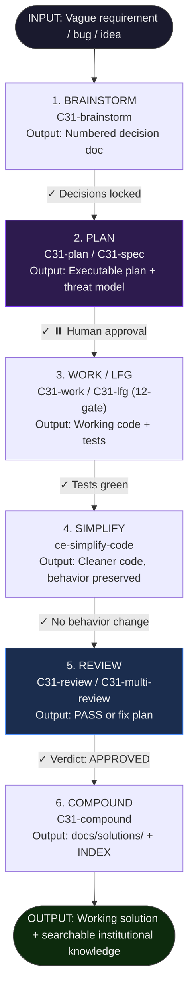
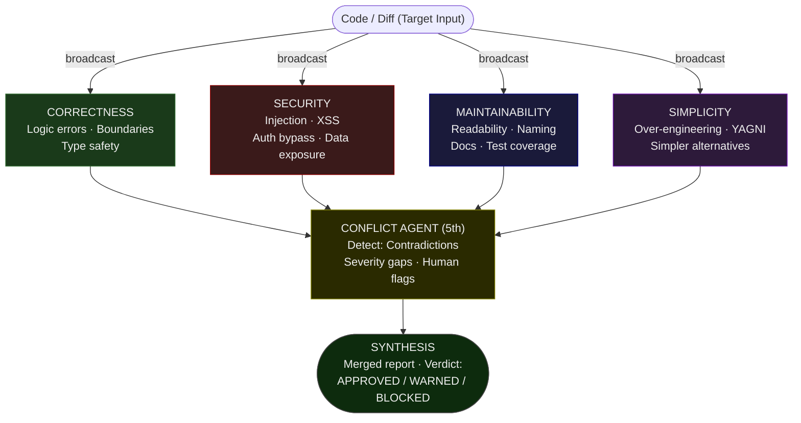
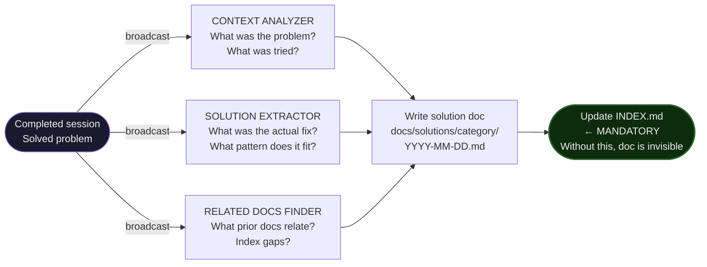

# C31 Workflow Architecture — Multi-Agent Orchestration & Lifecycle

> *"A specialized agent doing one thing well outperforms a single agent trying to brainstorm, code, test, review, and document all at once. Delegation is not a feature — it's an architectural requirement."*
> — The 2026 Consensus, C31

---

[English](WORKFLOW.md) · [中文](WORKFLOW.zh.md) · [日本語](WORKFLOW.ja.md)

---

## Part 1: The 6-Step Engineering Lifecycle

C31 enforces a structured lifecycle where **every step has defined inputs, outputs, and verification gates**. No step is a black box.



```
┌──────────────────────────────────────────────────────────────────────┐
│  INPUT: Vague requirement / bug report / feature idea                │
└──────────────────┬───────────────────────────────────────────────────┘
                   │
          ┌────────▼────────┐
          │  1. BRAINSTORM  │  C31-brainstorm
          │  Clarify scope  │  Output: Numbered decision points doc
          └────────┬────────┘
                   │ ✓ Decisions locked
          ┌────────▼────────┐
          │  2. PLAN        │  C31-plan / C31-spec
          │  Design + gate  │  Output: Executable plan + threat model
          └────────┬────────┘
                   │ ✓ ⏸️ Human approval gate
          ┌────────▼────────┐
          │  3. WORK / LFG  │  C31-work / C31-lfg (12-gate pipeline)
          │  Implement      │  Output: Working code + tests
          └────────┬────────┘
                   │ ✓ Tests green
          ┌────────▼────────┐
          │  4. SIMPLIFY    │  ce-simplify-code
          │  Tidy pass      │  Output: Cleaner code, behavior preserved
          └────────┬────────┘
                   │ ✓ No behavior change
          ┌────────▼────────┐
          │  5. REVIEW      │  C31-review / C31-multi-review
          │  Multi-agent    │  Output: Verified PASS or fix plan
          └────────┬────────┘
                   │ ✓ Verdict: APPROVED
          ┌────────▼────────┐
          │  6. COMPOUND    │  C31-compound
          │  Capture + index│  Output: docs/solutions/ + INDEX entry
          └────────┬────────┘
                   │
┌──────────────────▼───────────────────────────────────────────────────┐
│  OUTPUT: Working solution + searchable institutional knowledge        │
└──────────────────────────────────────────────────────────────────────┘
```

### Step Details

| Step | Skill | Input | Output | Verification Gate |
|------|-------|-------|--------|------------------|
| **1. Brainstorm** | `C31-brainstorm` | Vague requirement | Numbered decision-point document | All decisions numbered and locked |
| **2. Plan** | `C31-plan` / `C31-spec` | Decision doc | Executable plan + threat model | ⏸️ Human approval required |
| **3. Work** | `C31-work` / `C31-lfg` | Approved plan | Working code + passing tests | Tests green; 12-gate CI pipeline passes |
| **4. Simplify** | `ce-simplify-code` | Passing code | Cleaner code | Behavior unchanged (no regressions) |
| **5. Review** | `C31-review` / `C31-multi-review` | Clean code | Verified or fix plan | Verdict: APPROVED |
| **6. Compound** | `C31-compound` | Verified solution | `docs/solutions/` entry + INDEX | INDEX entry exists (without it, knowledge is invisible) |

### What makes this different from a checklist

The lifecycle is not a list of suggestions. Each step **feeds structured output into the next step**. The Plan step receives the exact numbered decisions from Brainstorm. The Work step executes against the exact plan. The Compound step indexes the exact solution so future agents can recall it in seconds.

**Context is passed as files, not conversation.** This implements the 12-Factor Agents principle F12 (Stateless Reducer): `f(context) → action`. Every step can be resumed from files alone, with no dependency on conversation history.

---

## Part 2: Multi-Agent Orchestration Patterns

C31 uses four distinct subagent orchestration patterns. Each serves a different purpose.

### Pattern A: Parallel Adversarial Review (C31-review / C31-multi-review)

The most sophisticated pattern. **4 specialized agents review the same code simultaneously, with zero shared context between them.** Their findings are then merged, deduplicated, and conflict-detected by a 5th agent.

```
                    ┌─────────────────┐
                    │  Code / Diff    │
                    │  (Target Input) │
                    └────────┬────────┘
                             │ (broadcast to all 4)
           ┌─────────────────┼─────────────────┐
           │                 │                 │                 │
  ┌────────▼──────┐ ┌────────▼──────┐ ┌────────▼──────┐ ┌────────▼──────┐
  │  CORRECTNESS  │ │   SECURITY    │ │MAINTAINABILITY│ │  SIMPLICITY   │
  │  Logic errors │ │ Injection/XSS │ │ Readability   │ │ Over-engineer │
  │  Boundaries   │ │ Auth bypass   │ │ Naming/Docs   │ │ YAGNI viola.  │
  │  Type safety  │ │ Data exposure │ │ Test coverage │ │ Simpler paths │
  └───────────────┘ └───────────────┘ └───────────────┘ └───────────────┘
           │                 │                 │                 │
           └─────────────────┼─────────────────┘─────────────────┘
                             │ (all findings)
                    ┌────────▼────────┐
                    │ CONFLICT AGENT  │  (5th agent)
                    │ Detect:         │
                    │ • Contradictions│
                    │ • Severity gaps │
                    │ • Human flags   │
                    └────────┬────────┘
                             │
                    ┌────────▼────────┐
                    │ SYNTHESIS       │
                    │ Merged report   │
                    │ Verdict:        │
                    │ APPROVED /      │
                    │ WARNED /        │
                    │ BLOCKED         │
                    └─────────────────┘
```



**Key design decisions:**
- Each agent is **read-only** — no agent edits files, commits, or pushes
- Each agent is **isolated** — no shared context prevents groupthink
- **Conflict is data, not failure** — disagreements between agents are surfaced as human-decision items, not auto-resolved
- Confidence is promoted when 2+ agents agree on the same finding (50→75, 75→100)
- P0 findings survive even at low confidence; style nits are suppressed below confidence 75

**The "Do Not Trust the Report" principle (from Superpowers/Archon):**
When a verifier subagent reviews an executor subagent's work, it independently verifies — it never relies on the executor's self-report. "It's done" does not mean "it conforms to spec."

---

### Pattern B: Parallel Knowledge Extraction (C31-compound)

When a problem is solved, three agents run simultaneously to extract and document the knowledge.

```
  ┌─────────────────────────────────────┐
  │  Completed session / solved problem │
  └──────────────────┬──────────────────┘
                     │ (broadcast)
     ┌───────────────┼───────────────┐
     │               │               │
┌────▼────┐    ┌──────▼──────┐  ┌────▼───────┐
│CONTEXT  │    │ SOLUTION    │  │ RELATED    │
│ANALYZER │    │ EXTRACTOR   │  │ DOCS FINDER│
│         │    │             │  │            │
│What was │    │What was the │  │What prior  │
│the prob?│    │actual fix?  │  │docs relate?│
│What was │    │What pattern │  │Index gaps? │
│tried?   │    │does it fit? │  │            │
└────┬────┘    └──────┬──────┘  └────┬───────┘
     │               │               │
     └───────────────┼───────────────┘
                     │ (synthesis)
          ┌──────────▼──────────┐
          │  Write solution doc │
          │  docs/solutions/    │
          │  [category]/        │
          │  YYYY-MM-DD.md      │
          └──────────┬──────────┘
                     │
          ┌──────────▼──────────┐
          │  Update INDEX.md    │  ← MANDATORY
          │  (without this,     │
          │   doc is invisible) │
          └─────────────────────┘
```



**The Recall Protocol (Pre-Search):**  
Before starting any non-trivial task, C31 silently checks `solutions-registry.md` → `INDEX.md` → relevant category. If a prior solution matches (≥1 keyword hit), it is surfaced immediately. The next occurrence of the same class of problem takes minutes, not hours.

---

### Pattern C: Fix-it Cascade (C31-debug → fix → verify → compound)

When debugging, C31 triggers a deterministic chain — no manual step-by-step required.

```
  User says "fix it" / "debug this"
              │
  ┌───────────▼──────────┐
  │  C31-debug           │  Root cause analysis
  │  • Reproduce         │  (hypothesis → minimal repro → verify)
  │  • Hypothesize       │
  │  • Locate root cause │
  └───────────┬──────────┘
              │ Root cause identified
  ┌───────────▼──────────┐
  │  Fix                 │  Surgical change only
  │  (Surgical scope)    │  Chesterton's Fence: understand before touching
  └───────────┬──────────┘
              │ Fix applied
  ┌───────────▼──────────┐
  │  Verify              │  Run tests / manual confirm
  │  (Nyquist check)     │  Must pass before declaring done
  └───────────┬──────────┘
              │ PASS
  ┌───────────▼──────────┐
  │  C31-compound        │  Auto-triggered
  │  (if >1 iteration)   │  "This bug's solution is worth recording"
  └──────────────────────┘
```

```mermaid
flowchart TD
    T([\"User: 'fix it' / 'debug this'\"]) --> D
    D[\"C31-debug\\nReproduce \u00b7 Hypothesize\\nLocate root cause\"]
    D -->|\"Root cause identified\"| F
    F[\"Fix\\nSurgical scope only\\nChesterton's Fence first\"]
    F -->|\"Fix applied\"| V
    V{\"Verify\\nNyquist check\"}
    V -->|\"PASS\"| C
    V -->|\"FAIL\"| F
    C[\"C31-compound\\nAuto-triggered if >1 iteration\"]
    C --> OUT([\"Bug fixed + solution documented\"])
    style T fill:#1a1a2e,color:#eee
    style V fill:#2a1a00,color:#eee,stroke:#cc8800
    style OUT fill:#0d2b0d,color:#eee,stroke:#444
```

**The 3-consecutive-failure rule:** If the same class of fix fails 3 times in a row, the chain halts and escalates to the user — it does not retry blindly.

---

### Pattern D: Full Automation Pipeline (C31-lfg — 12-gate)

For approved plans, C31-lfg runs the full pipeline with zero interruptions — unless a hard gate fails.

```
C31-lfg  ←  "lfg" / "开干" / "let's go"  (requires approved plan)

Gate  1: Read plan + validate completeness
Gate  2: Dependency check (no missing libs, env vars)
Gate  3: Test baseline (existing tests green before touching code)
Gate  4: Implement (surgical changes, one task at a time)
Gate  5: C31-multi-review (strict mode — any blocker = STOP)
Gate  6: Unit tests for new code
Gate  7: Integration tests
Gate  8: Nyquist compliance (coverage check)
Gate  9: ce-simplify-code (tidy pass)
Gate 10: Security scan
Gate 11: Build / compile verification
Gate 12: C31-compound (mandatory knowledge capture)

STOP conditions: Gate 5 blocker · 3 consecutive failures · unresolvable conflict
AUTO conditions: All gates pass → report summary → done
```

This is what "architecture beats prompts" means in practice. No prompting required at each step — the pipeline executes deterministically.

---

## Part 3: The Human-in-the-Loop Architecture

C31's human-in-the-loop (HITL) design is explicit and configurable.

### Decision Boundary

Every action falls into one of two layers:

| Layer | Definition | AI Behavior |
|-------|-----------|-------------|
| **Execution Layer** | Mistakes undoable in <10 minutes without damage | AI acts autonomously, no confirmation |
| **Decision Layer** | Mistakes irreversible or scope exceeds current task | Pause — await human confirmation |

**Execution Layer examples:** Format changes, prompt tweaks, adding new files, list edits  
**Decision Layer examples:** File overwrite, project direction change, external publish, deletion

**Pause format (structured for fast human decisions):**
```
⏸️ [Type: File Overwrite / Project Direction / External Publish]
   [Impact: <specific description>]
   [Needs: Confirm / Modify / Cancel]
```

### Confidence Routing

Before executing, C31 scores intent confidence:

| Confidence | Condition | Behavior |
|------------|-----------|----------|
| **High ≥0.75** | Intent clear, context sufficient | Execute directly |
| **Mid 0.55–0.74** | Ambiguous but inferable | One-line confirmation: "You mean X, right?" |
| **Low <0.55** | Requirements unclear or key params missing | Ask clarifying question |

This prevents the most common AI failure mode: confidently executing the wrong thing.

---

## Part 4: Knowledge Compounding Architecture

The final piece is how C31 makes the system smarter over time.

```
┌─────────────────────────────────────────────────────────┐
│                  KNOWLEDGE FLYWHEEL                      │
│                                                          │
│   Solve problem                                          │
│       │                                                  │
│       ▼                                                  │
│   C31-compound → docs/solutions/[category]/YYYY-MM-DD.md │
│       │                                                  │
│       ▼                                                  │
│   Update INDEX.md (mandatory — without this, invisible)  │
│       │                                                  │
│       ▼                                                  │
│   Update solutions-registry.md (cross-project index)     │
│       │                                                  │
│       ▼                                                  │
│   Next session: Pre-Search silently checks registry       │
│       │                                                  │
│       ▼                                                  │
│   Hit → "📋 Found prior art: [filename]" → inject        │
│   Miss → continue silently                               │
│       │                                                  │
│       ▼                                                  │
│   Next occurrence of same problem: minutes, not hours     │
└─────────────────────────────────────────────────────────┘
```

**Dual-store architecture:** Every solution is simultaneously written to:
1. Local project `docs/solutions/` (project-specific context)
2. Global `solutions-registry.md` (cross-project recall)

Any new project bootstrapped with C31 instantly inherits all prior solutions.

---

## Summary: What This Architecture Enables

| Capability | Mechanism | vs. Without C31 |
|-----------|-----------|-----------------|
| Code reviewed by 4 angles simultaneously | Parallel adversarial subagents | Single perspective / sequential |
| AI that gets smarter over sessions | Instinct evolution + session state | Resets to baseline every session |
| Bugs that don't recur | Fix-it Cascade → compound | Fixed once, forgotten |
| Plans that can't be broken halfway | 12-gate LFG pipeline | Ad-hoc, human-dependent |
| Context that doesn't rot | 4-state health monitoring | Degrades silently |
| Trust but verify subagents | Do Not Trust the Report | Self-report accepted at face value |

→ **[README.md](README.md)** — System overview  
→ **[PHILOSOPHY.md](PHILOSOPHY.md)** — Engineering principles  
→ **[ADVANTAGES.md](ADVANTAGES.md)** — C31 vs individual frameworks  
→ **[ERROR-GOVERNANCE.md](ERROR-GOVERNANCE.md)** — Error handling architecture
